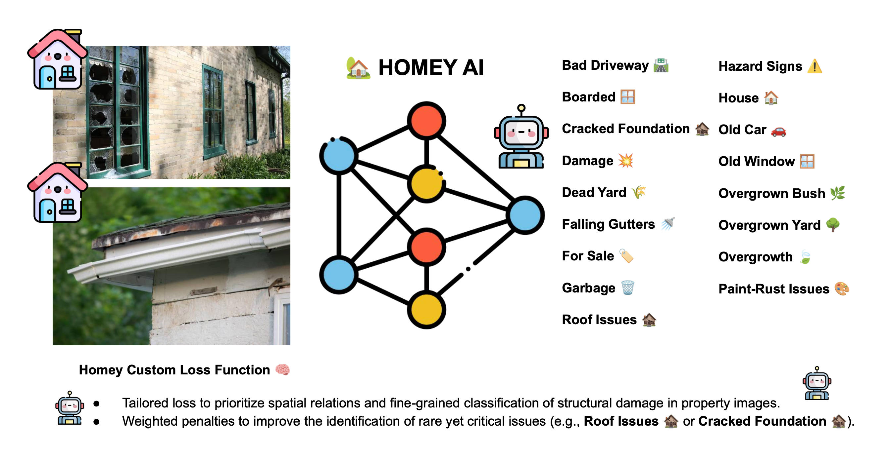
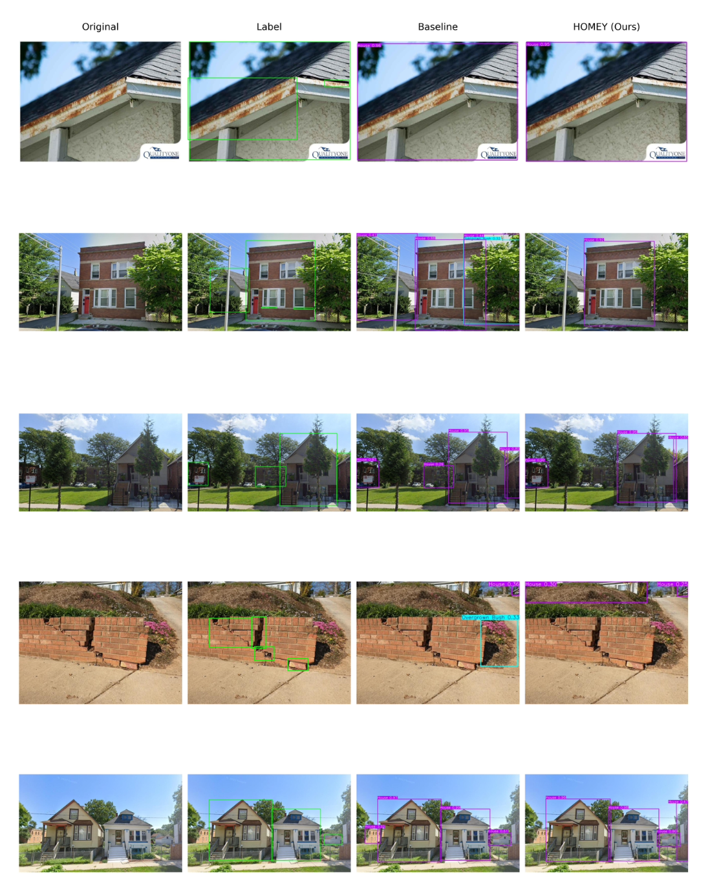
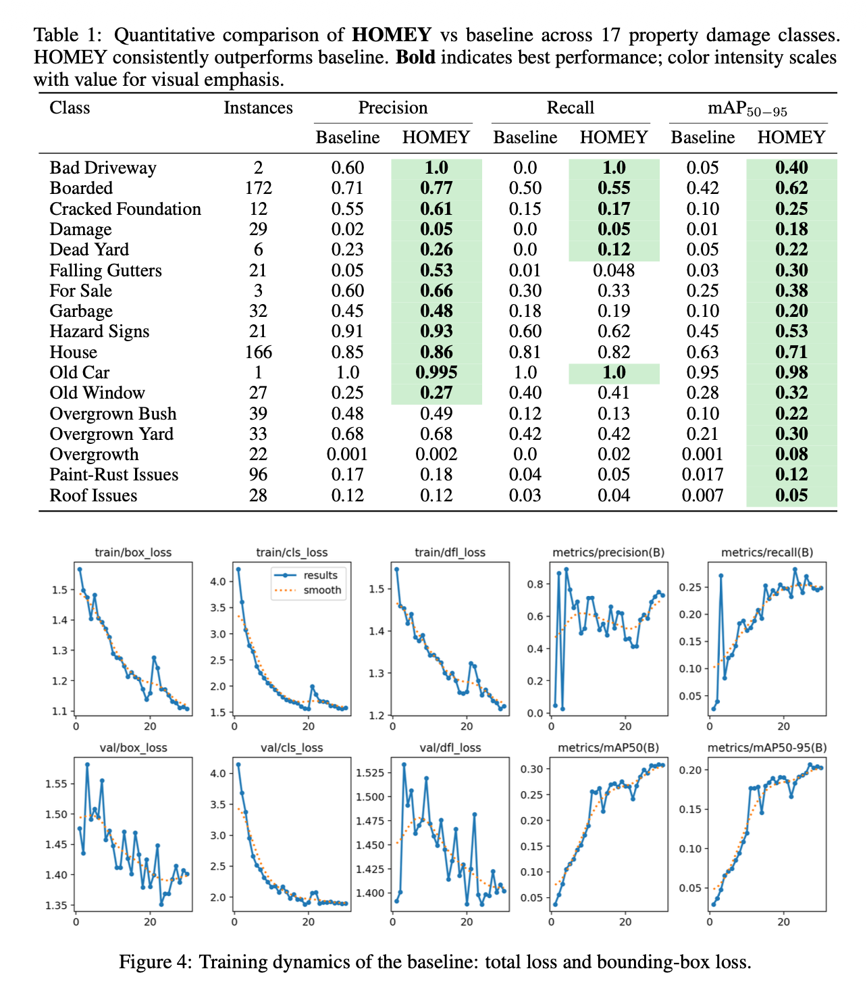

# 🏠 HOMEY: Heuristic Object Masking with Enhanced YOLO for Property Insurance Risk Detection

<div align="center">

**Teerapong Panboonyuen**
MARSAIL (Motor AI Recognition Solution Artificial Intelligence Laboratory)
<!-- 🎓 Supported by the **Talent Scholarship for Exceptional Ability**<br/><br/> -->

**Preprint on arXiv (March 2026)** 📄
arXiv: [2603.18502](https://arxiv.org/abs/2603.18502)

</div>

---

<p align="center">
  
</p>

## 🚀 Overview

**HOMEY** is a novel framework for **AI-driven property risk detection**, combining **YOLO object detection** with **domain-specific heuristic masking** and **risk-aware loss calibration**.

The model targets 17 classes of **property risk indicators**, including:

* Structural damage (cracked foundations, roof issues)
* Maintenance neglect (dead yards, overgrown bushes)
* Liability hazards (falling gutters, hazard signs, garbage)

Property imagery often contains **cluttered scenes with subtle risk cues**. HOMEY enhances detection by **amplifying weak signals** through heuristic object masking while maintaining **fast, reliable inference**, suitable for real-world insurance workflows.

---

## ✨ Key Innovations

🔹 **Heuristic Object Masking**

* Enhances weak visual signals in complex, cluttered environments
* Focuses YOLO on regions most indicative of risk

🔹 **Risk-Aware Loss Calibration**

* Balances class skew
* Weights severe hazards higher than minor issues
* Improves model reliability for insurance-critical tasks

🔹 **Integrated YOLO Enhancement**

* Maintains real-time inference speeds
* Compatible with YOLOv8 backbones
* Easily extendable to new property risk classes

---

## 📊 Qualitative Results — Risk Highlighting

<p align="center">
  
</p>

Models **without heuristic masking** often miss subtle hazards or over-focus on background clutter.
HOMEY shifts attention to **high-risk property regions**, improving interpretability for underwriting teams.

---

## 📈 Detection Performance

<p align="center">
  
</p>

On real-world property datasets:

✅ Higher mAP (mean Average Precision) across 17 classes
✅ Reduced false negatives for critical hazards
✅ Fast inference (~YOLO-level speed)
✅ Stable performance under varied property conditions

---

## 📖 Official Publication

### 🏆 arXiv Preprint (March 2026)

🔗 **arXiv Link:** [https://arxiv.org/abs/2603.18502](https://arxiv.org/abs/2603.18502)

📌 **DOI:** [10.48550/arXiv.2603.18502](https://doi.org/10.48550/arXiv.2603.18502)

---

## 🧠 Why HOMEY Matters

Property risk detection for insurance requires models that are:

* ✔ Robust to cluttered scenes and variable image quality
* ✔ Sensitive to both subtle and severe hazards
* ✔ Interpretable for underwriting decisions
* ✔ Fast enough for real-time inspection workflows

HOMEY achieves this by **enhancing signal extraction** rather than just increasing network depth or dataset size.

---

## 🚀 Training HOMEY

We provide a **reproducible PyTorch pipeline** in the `src/` directory. HOMEY supports:

* 🧠 YOLOv8 backbones
* 🏠 Multi-class property risk training (17 risk classes)
* 🔍 Heuristic object masking integration
* 📈 Risk-aware loss weighting
* 💻 GPU-accelerated training

---

### 📂 Project Structure

```
HOMEY/
│
├── src/
│   ├── train_homey.py
│   ├── models/
│   ├── datasets/
│   ├── losses/
│   └── utils/
│
├── data/
│   ├── train/
│   ├── val/
│   └── test/
│
└── outputs/
```

Each class folder in `train/` or `val/` should contain images labeled by risk type:

```
train/
    cracked_foundation/
    overgrown_bushes/
    falling_gutters/
    ...
```

---

### ⚙️ Installation

```bash
git clone https://github.com/kaopanboonyuen/HOMEY.git
cd HOMEY

conda create -n homey python=3.10
conda activate homey

pip install -r requirements.txt
```

---

### ▶️ Training Example

```bash
python src/train_homey.py \
    --train_dir data/train \
    --val_dir data/val \
    --backbone yolov8n \
    --epochs 100 \
    --batch_size 16 \
    --lr 3e-4
```

---

### 💾 Outputs

```
outputs/
    best_model.pth
    training_logs/
    detection_results/
```

Automatic tracking of:

✅ Validation mAP per class
✅ Risk-weighted loss curves
✅ Checkpoint saving with GPU support

---

### 🧠 Why This Training Matters

HOMEY training **directly targets real-world insurance risk detection**:

* Suppresses false alarms in cluttered backgrounds
* Enhances detection of subtle hazard cues
* Balances minor vs. severe risks with custom loss
* Produces interpretable detection masks for human review

> **The model sees property risk — not irrelevant background clutter.**

---

## 🙏 Acknowledgement

🎓 Talent Scholarship for Exceptional Ability
🏫 College of Computing, Khon Kaen University

---

### 📚 BibTeX Citation

```bibtex
@article{panboonyuen2026homey,
  author    = {Teerapong Panboonyuen},
  title     = {HOMEY: Heuristic Object Masking with Enhanced YOLO for Property Insurance Risk Detection},
  journal   = {arXiv preprint arXiv:2603.18502},
  year      = {2026},
  doi       = {10.48550/arXiv.2603.18502}
}
```

---

⭐ If you find this project useful, please consider starring the repository!

---